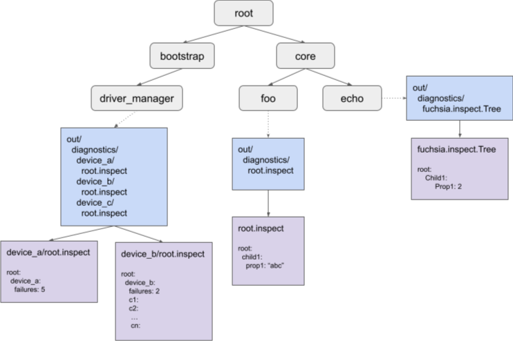

# Using Inspect for drivers

## Pre-requisites

In case you are not familiarized with Inspect, it is recommend that you read the
following pages:

- [Inspect overview][inspect_overview]
- [Inspect codelab][inspect_codelab]

<!-- TODO(fxbug.dev/60811): link to the selectors doc when it's submitted -->

## Introduction

Inspect can be used by drivers. However, there are some special considerations that must be made
given that drivers are not components.

Note: There is work being done to represent drivers as components using Components V2. For more
information, see [Implementing drivers as components][roadmap-drivers-components].

Consider the following system topology diagram:



Diagram legend:

*Gray*: Components.
*Blue*: Component namespace that shows the out/diagnostics directory contents.
*Purple*: Contents of the `out/diagnostics/*` inspect files.

Components can expose inspect data in the following ways:

- VMO file: Typically called `root.inspect`
- Tree service: A service file for the `fuchsia.inspect.Tree` protocol

A component can expose one or more of these files. In the diagram above, components `foo` and
`echo` expose a single file. However, `driver_manager` exposes multiple files, one VMO file for
each device.

The reason for this is that each device is not a component, therefore `driver_manager` aggregates
their inspect VMOs and publishes them itself. This is a major difference between exposing inspect
data from a component and from a driver that has implications in how the data can be queried
through selectors.

If you wanted to query data for the `foo` and `echo` components, you can express that in a
specific selector. For example, `core/foo:root/child1:prop1`, `core/echo:root/child1:prop1`. You
have a unique way of querying each even if the properties and nodes are called the same way given
that you can uniquely identify them using their moniker.

However, when it comes to drivers, it’s recommended that all devices expose an inspect hierarchy
where the root has a single child with the name of the device for a better experience using
selectors to query their data. All other properties and nodes are children of this child.

In the diagram above, you can query: `bootstrap/driver_manager:root/device_a:failures` and
`bootstrap/driver_manager:root/device_b:failures` uniquely. If neither `device_a` nor `device_b`
exposed their inspect VMO with a `root/{device name}` node where all properties are located, you
wouldn’t have a way of differencing between both and the selector
`bootstrap/driver_manager:root:failures` would match both of them.

## Including Inspect in drivers

These steps walk you through how to include Inspect in your drivers. For a full example of a driver
with Inspect included, see the following [example test driver][example_test_driver].

1. Add the zircon inspect library to your driver dependencies in BUILD.gn:

  ```
  deps = [
      ...
      "//zircon/system/ulib/inspect",
  ],
  ```

1. Include this header in your driver:

  ```
  #include <lib/inspect/cpp/inspect.h>
  ```

1. Create an Inspector instance in your device class:

  ```
  class TestDevice {
   …
   private:
       inspect::Inspector inspect_;
  }
  ```

  Use this to create properties and children to build the inspect tree:

  ```
  TestDevice::TestDevice() {
      state_ = inspect_.GetRoot().CreateString("state","invalid");
      // inspect is a tree; You can add children and structure your data.
      performance_ = inspect_.GetRoot().CreateChild("performance");
      call_count_ = performance_.CreateUint("call_count",0);
      total_time_ = performance_.CreateUint("total_time(ms)",0);
      ...
  }

  TestDevice::SetState(State s) {
    call_count_.Add(1);
    ...
      case kActive:
        state_.Set("active");
  }
  ```

  Inspect currently supports a variety of [property types][property_types] like integers, strings,
  arrays, bool, double, histograms.

  Inspect is RAII so remember to hold references to properties that you will update, otherwise
  they’ll be removed from the inspect VMO.

  ```
  class TestDevice {
   …
   private:
       inspect::Inspector inspect_;
       inspect::StringProperty state_;
       inspect::Node performance_;
       inspect::UintProperty call_count_;
       inspect::UintProperty total_time_;
  }
  ```

  You can add properties and nodes to an  `inspect::ValueList` instead of holding references to them.
  This will tie the lifetime of the properties and nodes with the lifetime of the
  `inspect::ValueList`. Note that `inspect::Inspector` happens to be a ValueList for convenience.

  ```
  inspect_.GetRoot().CreateString("name","test device",&inspect_);
  inspect_.GetRoot().CreateString("config_params",config,&inspect_);
  ```

1. Export inspect VMO to driver manager.

  ```
  zx_status Bind() {
    …
      DdkAdd(ddk::DeviceAddArgs("test").set_inspect_vmo(inspect_.DuplicateVmo()));
  }
  ```

  You can publish one inspect VMO per device; Instance devices do not count. To add inspect for
  instance devices, you can create child nodes from the devices’ inspect and add to it.

1. Done. Now you can view Inspect data for the driver.

  - The device inspect file is hosted in /dev/diagnostics/class/<protocol>/xxx.inspect
  - Check the inspect data using `iquery`

    ```
    fx iquery show-file /dev/diagnostics/class/ethernet/000.inspect

    // To view all of driver_manager and driver host
    fx iquery show 'bootstrap/driver_manager'
    ```

1. Run `fx snapshot` and check if your inspect data is present in `inspect.json`. Note that the
feedback component is not part of bringup, so taking snapshots is not very useful when working
only with a bringup build. For these situations, prefer using `iquery` which is available in bootfs.

  Note: Don’t forget to write tests for the inspect code. You can look at the inspect
  [codelab][inspect_codelab] or [the driver host inspect test][driver_host_inspect_test] for some
  examples.

### Isolated devmgr

You can view devfs with `/hub`, which enables tools like `iquery` on tests using isolated devmgr.

1. If you are using `src/lib/isolated_devmgr/isolated_devmgr.gni`, then it’ll automatically be
  hosted in the test’s out directory.

  Example:

  ```
  iquery show-file  /hub/r/test_env_**/**/c/fs-management-devmgr.cmx/**/out/dev/diagnostics/driver_manager/dm.inspect
  ```

1. If you are using `zircon/system/ulib/devmgr-integration-test/isolated_devmgr.gni`, you will need
to call `AddDevfsToOutgoingDir` on the devmgr instance ([example][devmgr_integration_test]) to host
devfs in the test’s out directory. Once this is done, viewing the inspect file is similar to the
previous point.


[selectors]: https://docs.google.com/document/d/1gI3FizKlTlth9DL8l7Ja9f7xuY_GKDffa5x1uZesLMY/edit
[inspect_overview]: /docs/development/diagnostics/inspect/README.md
[Inspect codelab]: /docs/development/diagnostics/inspect/codelab.md
[roadmap_drivers_components]: /docs/contribute/roadmap/2020/overview.md#implementing_drivers_as_components
[example_test_driver]: /src/devices/tests/driver-inspect-test/test-driver.cc
[property_types]: /docs/development/diagnostics/inspect/README.md#property
[inspect_codelab]: /docs/development/diagnostics/inspect/codelab/README.md
[driver_host_inspect_test]: /src/devices/bin/driver_host/inspect_test.cc
[devmgr_integration_test]: /zircon/system/ulib/devmgr-integration-test/test/launcher_test.cc#113
