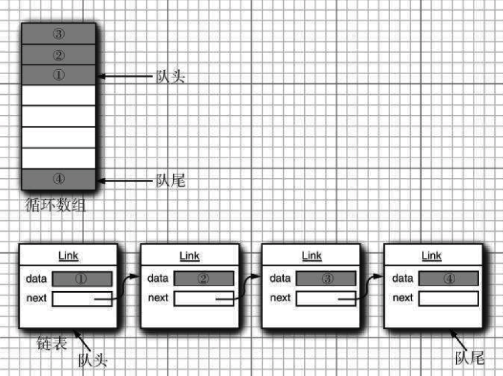

# Java集合指南


## 简介

### 作用和本质

- 集合的主要作用是存储对象的容器

- 集合的本质是用于存储对象的数据结构

官方文档地址：https://docs.oracle.com/javase/tutorial/collections/index.html


### 集合类型

集合类存放于 Java.util 包中，主要有 3 种: set(集)、list(列表包含 Queue)和 map(映射)。

1. Collection:Collection 是集合 List、Set、Queue 的最基本的接口。
2. Iterator:迭代器，可以通过迭代器遍历集合中的数据
3. Map:是映射表的基础接口


## 数据结构

### 数组




### 链表


### 树


## 集合

### Collection

#### List

Java 的 List 是非常常用的数据类型。List 是有序的 Collection。Java List 一共三个实现类: 分别是

ArrayList、Vector 和 LinkedList。

#### ArrayList(数组)


ArrayList 是最常用的 List 实现类，内部是通过数组实现的，它允许对元素进行快速随机访问。数组的

缺点是每个元素之间不能有间隔，当数组大小不满足时需要增加存储能力，就要将已经有数组的数据复

制到新的存储空间中。当从 ArrayList 的中间位置插入或者删除元素时，需要对数组进行复制、移动、

代价比较高。因此，它适合随机查找和遍历，不适合插入和删除。

#### Vector(数组实现、线程同步)

Vector 与 ArrayList 一样，也是通过数组实现的，不同的是它支持线程的同步，即某一时刻只有一个线

程能够写 Vector，避免多线程同时写而引起的不一致性，但实现同步需要很高的花费，因此，访问它比

访问 ArrayList 慢。

#### LinkList(链表)

LinkedList 是用链表结构存储数据的，很适合数据的动态插入和删除，随机访问和遍历速度比较 慢。另

外，他还提供了 List 接口中没有定义的方法，专门用于操作表头和表尾元素，可以当作堆 栈、队列和

双向队列使用。

#### Set

Set 注重独一无二的性质,该体系集合用于存储无序(存入和取出的顺序不一定相同)元素，值不能重复。

对象的相等性本质是对象 hashCode 值(java 是依据对象的内存地址计算出的此序号)判断 的，如果想要

让两个不同的对象视为相等的，就必须覆盖 Object 的 hashCode 方法和 equals 方 法。

**HashSet(Hash 表)**

哈希表边存放的是哈希值。HashSet 存储元素的顺序并不是按照存入时的顺序(和 List 显然不 同) 而是

按照哈希值来存的所以取数据也是按照哈希值取得。元素的哈希值是通过元素的 hashcode 方法来获取

的, HashSet 首先判断两个元素的哈希值，如果哈希值一样，接着会比较 equals 方法 如果 equals 结果

为 true ，HashSet 就视为同一个元素。如果 equals 为 false 就不是同一个元素。

哈希值相同 equals 为 false 的元素是怎么存储呢,就是在同样的哈希值下顺延(可以认为哈希值相 同的元

素放在一个哈希桶中)。也就是哈希一样的存一列。如图 1 表示 hashCode 值不相同的情 况;图 2 表示

hashCode 值相同，但 equals 不相同的情况。

HashSet 通过 hashCode 值来确定元素在内存中的位置。一个 hashCode 位置上可以存放多个元素。


**TreeSet(二叉树)**

1. TreeSet()是使用二叉树的原理对新 add()的对象按照指定的顺序排序(升序、降序)，每增 加一个对
象都会进行排序，将对象插入的二叉树指定的位置。
2. Integer 和 String 对象都可以进行默认的 TreeSet 排序，而自定义类的对象是不可以的，自 己定
  义的类必须实现 Comparable 接口，并且覆写相应的 compareTo()函数，才可以正常使 用。
3. 在覆写 compare()函数时，要返回相应的值才能使 TreeSet 按照一定的规则来排序

4. 比较此对象与指定对象的顺序。如果该对象小于、等于或大于指定对象，则分别返回负整数、零或正整数。

**LinkHashSet(HashSet+LinkedHashMap)**

对于 LinkedHashSet 而言，它继承与 HashSet、又基于 LinkedHashMap 来实现的。LinkedHashSet

底层使用 LinkedHashMap 来保存所有元素，它继承与 HashSet，其所有的方法操作上又与 HashSet

相同，因此 LinkedHashSet 的实现上非常简单，只提供了四个构造方法，并通过传递一个标识参数，

调用父类的构造器，底层构造一个 LinkedHashMap 来实现，在相关操作上与父类 HashSet 的操作相

同，直接调用父类 HashSet 的方法即可。

#### Queue

### Map

#### HashMap(数组+链表+红黑树)

HashMap 根据键的 hashCode 值存储数据，大多数情况下可以直接定位到它的值，因而具有很快

的访问速度，但遍历顺序却是不确定的。 HashMap 最多只允许一条记录的键为 null，允许多条记

录的值为 null。HashMap 非线程安全，即任一时刻可以有多个线程同时写 HashMap，可能会导

致数据的不一致。如果需要满足线程安全，可以用 Collections 的 synchronizedMap 方法使

HashMap 具有线程安全的能力，或者使用 ConcurrentHashMap。我们用下面这张图来介绍

HashMap 的结构。

#### JAVA7 实现

大方向上，HashMap 里面是一个数组，然后数组中每个元素是一个单向链表。上图中，每个绿色

的实体是嵌套类 Entry 的实例，Entry 包含四个属性：key, value, hash 值和用于单向链表的 next。

```
1. capacity：当前数组容量，始终保持 2^n，可以扩容，扩容后数组大小为当前的 2 倍。
2. loadFactor：负载因子，默认为 0.75。
3. threshold：扩容的阈值，等于 capacity * loadFactor
```
#### JAVA8 实现

Java8 对 HashMap 进行了一些修改，最大的不同就是利用了红黑树，所以其由 数组+链表+红黑


##### 树 组成。

根据 Java7 HashMap 的介绍，我们知道，查找的时候，根据 hash 值我们能够快速定位到数组的

具体下标，但是之后的话，需要顺着链表一个个比较下去才能找到我们需要的，时间复杂度取决

于链表的长度，为 O(n)。为了降低这部分的开销，在 Java8 中，当链表中的元素超过了 8 个以后，

会将链表转换为红黑树，在这些位置进行查找的时候可以降低时间复杂度为 O(logN)。

### HashTable(线程安全)

Hashtable 是遗留类，很多映射的常用功能与 HashMap 类似，不同的是它承自 Dictionary 类，

并且是线程安全的，任一时间只有一个线程能写 Hashtable，并发性不如 ConcurrentHashMap，

因为 ConcurrentHashMap 引入了分段锁。Hashtable 不建议在新代码中使用，不需要线程安全

的场合可以用 HashMap 替换，需要线程安全的场合可以用 ConcurrentHashMap 替换。

### TreeMap(可排序)

TreeMap 实现 SortedMap 接口，能够把它保存的记录根据键排序，默认是按键值的升序排序，

也可以指定排序的比较器，当用 Iterator 遍历 TreeMap 时，得到的记录是排过序的。

在使用 TreeMap 时，key 必须实现 Comparable 接口或者在构造 TreeMap 传入自定义的

Comparator，否则会在运行时抛出 java.lang.ClassCastException 类型的异常。

### LinkHashMap(记录插入顺序)

LinkedHashMap 是 HashMap 的一个子类，保存了记录的插入顺序，在用 Iterator 遍历

LinkedHashMap 时，先得到的记录肯定是先插入的，也可以在构造时带参数，按照访问次序排序。

## 源码分析

### ArrayList源码解读

#### 数据结构

ArrayList内部是使用数组保存元素的，数据定义如下：

```java
transient Object[] elementData; // non-private to simplify nested class access
```


#### 多线程安全分析

##### add方法问题分析

```java
// ArrayList#add
public boolean add(E e) { ensureCapacityInternal(size + 1); //此处存在问题，因为size是线程共享的 elementData[size++] = e;
    return true;
}
```

此方法中有两个操作，一个是数组容量检查，另外就是将元素放入数据中。我们先看第二个简单的开始

分析，当多个线程执行顺序如下所示的时候，会出现最终数据元素个数小于期望值。


按照此顺序执行完之后，我们可以看到，elementData[n]的只被设置了两次，第二个线程设置的值将前

一个覆盖，最后size=n+1。下面使用代码进行验证此问题。


**代码验证**

首先先看下以下代码，开启 1000 个线程，同时调用ArrayList的add方法，每个线程向ArrayList中添加

100 个数字，如果程序正常执行的情况下应该是输出：

**代码如下：**

```java
list size is : 10000	
```
```java
package ai.youmi.array;

import java.util.ArrayList;
import java.util.concurrent.ExecutorService;
import java.util.concurrent.Executors;

/**
 * @author Dongchan Year
 */
public class ArrayListTest {

    private final static ExecutorService pool = Executors.newFixedThreadPool(1000);
    private static ArrayList<Integer> list = new ArrayList<>();

    public static void main(String[] args) {
        for (int i = 0; i < 10000; i++) {
            pool.submit(new IncreaseTask());
        }
        if (!pool.isTerminated()) {
            try {
                Thread.sleep(1000 * 10);
            } catch (InterruptedException e) {
                e.printStackTrace();
            }
        }
        System.out.println("Total execute number: " + 10000 * 100);
        System.out.println("Actual execute number: " + list.size());
    }

    private static class IncreaseTask extends Thread {
        @Override
        public void run() {
            System.out.println("ThreadId: " + Thread.currentThread().getId() + " start !");
            for (int i = 0; i < 100; i++) {
                list.add(i);
            }
            System.out.println("ThreadId: " + Thread.currentThread().getId() + " finish !");
        }
    }
}

```

```java
....................
....................
ThreadId: 653 finish !
ThreadId: 659 finish !
ThreadId: 611 start !
ThreadId: 611 finish !
ThreadId: 659 start !
ThreadId: 659 finish !
ThreadId: 651 start !
ThreadId: 651 finish !
ThreadId: 651 start !
ThreadId: 651 finish !
ThreadId: 235 start !
ThreadId: 235 finish !
Total execute number: 1000000
Actual execute number: 997567
```

从以上执行结果来看，最后输出的结果会小于我们的期望值。即当多线程调用add方法的时候会出现元

素覆盖的问题。

##### 数组容量检测的并发问题

在add方法源码中，我们看到在每次添加元素之前都会有一次数组容量的检测，add中调用此方法的源码如下：

```java
ensureCapacityInternal(size + 1 );
```
容量检测的相关源码如下：

```java
private static int calculateCapacity(Object[] elementData, int minCapacity) {
  if (elementData == DEFAULTCAPACITY_EMPTY_ELEMENTDATA) {
    return Math.max(DEFAULT_CAPACITY, minCapacity);
  }
  return minCapacity;
}

private void ensureCapacityInternal(int minCapacity) {
  ensureExplicitCapacity(calculateCapacity(elementData, minCapacity));
}

private void ensureExplicitCapacity(int minCapacity) {
  modCount++;

  // overflow-conscious code
  if (minCapacity - elementData.length > 0)
    grow(minCapacity);
}
```

我们以两个线程执行add操作来分析扩充容量可能会出现的并发问题： 当我们新建一个ArrayList时候，

此时内部数组容器的容量为默认容量 10 ，当我们用两个线程同时添加第 10 个元素的时候，如果出现以下

执行顺序，可能会抛出java.lang.ArrayIndexOutOfBoundsException异常。

第二个线程往数组中添加数据的时候由于数组容量为 10 ，而此操作往index为 10 的位置设置元素值，因

此会抛出数组越界异常。


##### Fail-fast 问题

```java
package ai.youmi.array;

import java.util.ArrayList;
import java.util.Iterator;

/**
 * Fail-Fast systems abort operation as-fast-as-possible exposing failure immediately and
 * stopping the whole operation.
 * The program use iterator with iterator when modCount != expectedModCount export exception in multi-thread.
 *
 * @author Dongchan Year
 */
public class ArrayListFailFast {

    public static void main(String[] args) {

        ArrayList<Integer> array = new ArrayList<>();
        for (int i = 0; i < 11; i++) {
            array.add(i);
        }

        new ArrayListIterator(array).start();
        new ArrayListAdd(array).start();
    }

    private static class ArrayListAdd extends Thread {
        private ArrayList<Integer> list;

        public ArrayListAdd(ArrayList<Integer> list) {
            this.list = list;
        }

        @Override
        public void run() {
            for (int i = 0; i < 11; i++) {
                this.list.add(i);
                System.out.println("Loop add value to list: " + i);
            }
        }
    }

    private static class ArrayListIterator extends Thread {
        private ArrayList<Integer> list;

        public ArrayListIterator(ArrayList<Integer> list) {
            this.list = list;
        }

        @Override
        public void run() {
            for (Iterator<Integer> iterator = this.list.iterator(); this.list.iterator().hasNext(); ) {
                System.out.println("Iterator value: " + iterator.next());
                try {
                    Thread.sleep(500);
                } catch (InterruptedException e) {
                    e.printStackTrace();
                }
            }
        }
    }
}

```

输出的结果如下：

```java
Iterator value: 0
Loop add value to list: 0
Loop add value to list: 1
Loop add value to list: 2
Loop add value to list: 3
Loop add value to list: 4
Loop add value to list: 5
Loop add value to list: 6
Loop add value to list: 7
Loop add value to list: 8
Loop add value to list: 9
Loop add value to list: 10
Exception in thread "Thread-0" java.util.ConcurrentModificationException
	at java.util.ArrayList$Itr.checkForComodification(ArrayList.java:909)
	at java.util.ArrayList$Itr.next(ArrayList.java:859)
	at ai.youmi.array.ArrayListFailFast$ArrayListIterator.run(ArrayListFailFast.java:55)

```


### HashMap源码分析

HashMap 根据键的 hashCode 值存储数据，大多数情况下可以直接定位到它的值，因而具有很快的访

问速度，但遍历顺序却是不确定的。

```
package com.naixue.vip.p6;
```
```
import java.util.ArrayList;
import java.util.List;
import java.util.concurrent.ExecutorService;
import java.util.concurrent.Executors;
```
##### /**

```
* @Description
* @Author 向寒 奈学教育
* @Date 2020/7/8 19:
**/
public class ArrayListTest2 {
private static List<Integer> list = new ArrayList<Integer>();
```
```
// private static ExecutorService executorService =
Executors.newFixedThreadPool(10000);
```
```
private static class IncreaseTask extends Thread{
@Override
public void run() {
System.out.println("ThreadId:" + Thread.currentThread().getId() + "
start!");
for(int i = 0 ; i < 1000000 ; i++){
list.add(i);
}
System.out.println("ThreadId:" + Thread.currentThread().getId() + "
finished!");
}
}
```
```
public static void main(String[] args) throws InterruptedException {
new IncreaseTask().start();
// 并发下数组容量检测存在问题，如果线性执行则没有
// Thread.sleep(200);
new IncreaseTask().start();
}
}
```

#### 核心概念

```
bin: 一个数组的entry表示一个桶
```
```
DEFAULT_INITIAL_CAPACITY=16：默认初始容量
```
```
MAXIMUM_CAPACITY：最大容量1 << 30
```
```
DEFAULT_LOAD_FACTOR=0.75f：扩容负载因子
```
```
TREEIFY_THRESHOLD=8：桶bins里链表深度的阀值。达到 8 并且table.length(体积)达到
MIN_TREEIFY_CAPACITY就把链表转成红黑树
```
```
UNTREEIFY_THRESHOLD=6：链表长度低于 6 ，就把红黑树转回链表
```
```
MIN_TREEIFY_CAPACITY=64：开始转换为树结构的值
```
```
threshold:扩容的阀值，随着table.size不断变化,扩容每次体积翻倍
```
#### 扩容机制

##### 数据结构转变规则

如果这个桶中bin的数量小于TREEIFY_THRESHOLD当然不会转化成树形结构存储；

如果这个桶中bin的数量大于了 TREEIFY_THRESHOLD ，但是capacity小于MIN_TREEIFY_CAPACITY 则

依然使用链表结构进行存储，此时会对HashMap进行扩容；

如果capacity大于了MIN_TREEIFY_CAPACITY ，则会进行树化。

**put分析**

HashMap#putVal

```
final V putVal(int hash, K key, V value, boolean onlyIfAbsent,
boolean evict) {
Node<K,V>[] tab; Node<K,V> p; int n, i;
if ((tab = table) == null || (n = tab.length) == 0 )
n = (tab = resize()).length; //初始化桶，默认 16 个元素
if ((p = tab[i = (n - 1 ) & hash]) == null) //如果第i个桶为空，创建Node实例
tab[i] = newNode(hash, key, value, null);
else { //哈希碰撞的情况， 即(n-1)&hash相等
Node<K,V> e; K k;
if (p.hash == hash &&
((k = p.key) == key || (key != null && key.equals(k))))
e = p; //key相同，后面会覆盖value
else if (p instanceof TreeNode)
e = ((TreeNode<K,V>)p).putTreeVal(this, tab, hash, key, value);  //红黑
树添加当前node
else {
for (int binCount = 0 ; ; ++binCount) {
if ((e = p.next) == null) {
p.next = newNode(hash, key, value, null);  //链表添加当前元素
if (binCount >= TREEIFY_THRESHOLD - 1 ) // -1 for 1st
treeifyBin(tab, hash);  //当链表个数大于等于 7 时，将链表改造为红
黑树
break;
}
if (e.hash == hash &&
((k = e.key) == key || (key != null && key.equals(k))))
```

map put流程

```
break;
p = e;
}
}
if (e != null) { // existing mapping for key
V oldValue = e.value;
if (!onlyIfAbsent || oldValue == null)
e.value = value;
afterNodeAccess(e);
return oldValue;  //覆盖key相同的value并return， 即不会执行
++size
}
}
++modCount;
if (++size > threshold)  //key不相同时，每次插入一条数据自增1. 当size大于threshold
时resize
resize();
afterNodeInsertion(evict);
return null;
}
```


##### 扩容过程

HashMap#resize

```
final Node<K,V>[] resize() {
newThr = oldThr << 1 ; // double threshold, 大小扩大为 2 倍，出于性能考虑和者告诉使
用者它是 2 的幂， 这里用的是位移， 而不是*2，
if (e.next == null)
newTab[e.hash & (newCap - 1 )] = e;  //如果该下标只有一个数据，则散列到当前位置或
者高位对应位置（以第一次resize为例，原来在第 4 个位置，resize后会存储到第 4 个或者第4+16个位置）
else if (e instanceof TreeNode)
((TreeNode<K,V>)e).split(this, newTab, j, oldCap);  //红黑树重构
else {
do {
next = e.next;
if ((e.hash & oldCap) == 0 ) {
if (loTail == null)
loHead = e;
else
loTail.next = e;
loTail = e;
} else {
if (hiTail == null)
hiHead = e;
else
hiTail.next = e;
hiTail = e;
}
} while ((e = next) != null);
if (loTail != null) {
loTail.next = null;
newTab[j] = loHead; //下标不变
```

#### HashMap的扩容及树化过程

通过不断向HashMap添加元素，查看HashMap的变化流程。

**基础类**

##### }

```
if (hiTail != null) {
hiTail.next = null;
newTab[j + oldCap] = hiHead; //下标位置移动原来容量大小
}
}
```
```
package com.naixue.vip.p6.HashMap;
```
```
import java.util.regex.Pattern;
```
```
public class Key {
```
```
private static final String REG = "[0-9]+";
```
```
private String key;
```
```
public Key(String key) {
this.key = key;
}
```
```
@Override
public boolean equals(Object o) {
if (this == o) {
return true;
}
if (o == null || getClass() != o.getClass()) {
return false;
}
```
```
Key mapKey = (Key) o;
```
```
return !(key != null? !key.equals(mapKey.key) : mapKey.key != null);
```
##### }

```
@Override
public int hashCode() {
if (key == null) {
return 0 ;
}
Pattern pattern = Pattern.compile(REG);
if (pattern.matcher(key).matches()) {
return 1 ;
} else {
return 2 ;
}
}
```

这个MapKey类用于作为HashMap的key的类型，实现了equals、hashCode、toString方法。其中，

hashCode方法故意将所有数字字符串key的hash值返回 1 ，其他字符串key的hash值返回 2 。

**测试类**

下面逐个阶段通过debug，查看map中的数据。

注意，在使用IDEA查看map的数据时，要设置view as Object。

```
@Override
public String toString() {
return key;
}
}
```
```
package org.fan.learn.map;
```
```
import java.util.HashMap;
import java.util.Map;
```
##### /**

```
* Created by fan on 2016/4/7.
*/
public class MainTest {
public static void main(String[] args) {
Map<MapKey,String> map = new HashMap<MapKey, String>();
/*
//第一阶段
for (int i = 0; i < 6; i++) {
map.put(new MapKey(String.valueOf(i)), "A");
}
*/
```
##### /*

##### //第二阶段

```
for (int i = 0; i < 10; i++) {
map.put(new MapKey(String.valueOf(i)), "A");
}
*/
```
##### /*

##### //第三阶段

```
for (int i = 0; i < 50; i++) {
map.put(new MapKey(String.valueOf(i)), "A");
}
*/
```
##### /*

##### //第四阶段

```
map.put(new MapKey("X"), "B");
map.put(new MapKey("Y"), "B");
map.put(new MapKey("Z"), "B");
*/
System.out.println(map);
}
}
```

==idea debug默认关闭了查看队列结构，这里一定要取消勾选==

##### 第一阶段

这个时候桶中bin的数量小于TREEIFY_THRESHOLD 。

threshold=capacity*loadFactor

也就是下一次resize的阈值，当HashMap中KV数里 ( 即entry数量)，超过 12 时会扩容

看一下table中具体的存储方式：


hash值都是 1 ，put了 6 个数据，小于capacity (16) *loadFactor(0.75)=12，因此还不用扩容，也不用树

化。

##### 第二阶段

这个时候桶中bin的数量大于了TREEIFY_THRESHOLD ，但是capacity不大于MIN_TREEIFY_CAPACITY

，则要扩容，使用链表结构存储。

此时 1 号桶中bin (KV数据)的数里是 10 ，已超过TREEIFY _THRESHOLD(8)_ ，而且当时的容里是 _16_ ，没有超

过 _MIN TREEIFY_ CAPACITY(64)，因此会扩容。现在threshold为 48 ，除以loadFactor (0.75) ，得到容里

capacity为 64 。


##### 从上图可以看出， 1 号桶中的存储结构依然是链表。

##### 第三阶段

这个时候桶中bin的数量大于了TREEIFY_THRESHOLD 且 capacity大于了MIN_TREEIFY_CAPACITY ，因

此，会树化。

因为这次放的KV里是 50 ，超过上次的threshold(48)，因此会扩容，

在resize时发现:

这次再放时由于原来的容里已经扩容到 64 ，已到达MIN_ _TREEIFY CAPACITY(64)_ ，而且 _1_ 号桶中 _bin_ 的数里

已超过 _TREEIFY_ _THRESHOLD(8)，因此会树化。这次扩容后的容里为96/0.75=128。

对这个输出map的值，可以看到是乱序的，因为是使用树形结构进行存储的。

**小结**

在JDK1.8中变红黑树数结构的两个条件

```
纵向桶的深度超过 8 个
扩容后总数超过阀值
```
##### 第四阶段

##### 这个阶段主要是测试，如果一个桶采用了树形结构存储，其他桶是不是也采用树形结构存储。结论是，

如果其他桶中bin的数量没有超过TREEIFY_THRESHOLD，则用链表存储，如果超过

```
TREEIFY_THRESHOLD ，则用树形存储。
```

#### 线程安全分析

**HashMap**

因为多线程环境下，使用 HashMap 进行 put 操作会引起死循环，导致 CPU 利用率接近 100%，所以

在并发情况下不能使用 HashMap，如以下代码

#### jdk1.7不安全分析(头插法)

```
HashMap的线程不安全主要是发生在扩容函数中，即根源是在 transfer函数 中，JDK1.7中HashMap的
transfer函数如下：
```
```
final HashMap<String, String> map = new HashMap<String, String>( 2 );
Thread t = new Thread(new Runnable() {
@Override
public void run() {
for (int i = 0 ; i < 10000 ; i++) {
new Thread(new Runnable() {
@Override
public void run() {
map.put(UUID.randomUUID().toString(), "");
}
}, "ftf" + i).start();
}
}
}, "ftf");
t.start();
t.join();
```
```
void transfer(Entry[] newTable, boolean rehash) {
int newCapacity = newTable.length;
for (Entry<K,V> e : table) {
while(null != e) {
Entry<K,V> next = e.next;
if (rehash) {
```

这段代码是HashMap的扩容操作，重新定位每个桶的下标，并采用头插法将元素迁移到新数组中。头插

法会将链表的顺序翻转，这也是形成死循环的关键点。理解了头插法后再继续往下看是如何造成死循环

以及数据丢失的。

**扩容造成死循环和数据丢失的分析过程**

假设现在有两个线程A、B同时对下面这个HashMap进行扩容操作：

##### 正常扩容后的结果是下面这样的：

但是当线程A执行到上面transfer函数的第 11 行代码时，CPU时间片耗尽，线程A被挂起。即如下图中

位置所示：

```
e.hash = null == e.key? 0 : hash(e.key);
}
int i = indexFor(e.hash, newCapacity);
e.next = newTable[i];
newTable[i] = e;
e = next;
}
}
}
```
```
void transfer(Entry[] newTable, boolean rehash) {
int newCapacity = newTable.length;
for (Entry<K,V> e : table) {
while(null != e) {
Entry<K,V> next = e.next;
if (rehash) {
e.hash = null == e.key? 0 : hash(e.key);
}
int i = indexFor(e.hash, newCapacity);
e.next = newTable[i];
newTable[i] = e;//线程在此处挂起
e = next;
}
}
```

此时线程A中：e=3、next=7、e.next=null

##### 当线程A的时间片耗尽后，CPU开始执行线程B，并在线程B中成功的完成了数据迁移

重点来了，根据Java内存模式可知，线程B执行完数据迁移后，此时主内存中newTable和table都是

最新的，也就是说：7.next=3、3.next=null。

##### }


随后线程A获得CPU时间片继续执行newTable[i] = e，将 3 放入新数组对应的位置，执行完此轮循环

后线程A的情况如下：

接着继续执行下一轮循环，此时e=7，从主内存中读取e.next时发现主内存中7.next=3，于是乎

next=3，并将 7 采用头插法的方式放入新数组中，并继续执行完此轮循环，结果如下：

执行下一次循环可以发现，next=e.next=null，所以此轮循环将会是最后一轮循环。接下来当执行完

e.next=newTable[i]即3.next=7后， 3 和 7 之间就相互连接了，当执行完newTable[i]=e后， 3 被头插法重

新插入到链表中，执行结果如下图所示：

上面说了此时e.next=null即next=null，当执行完e=null后，将不会进行下一轮循环。到此线程A、B的


扩容操作完成，很明显当线程A执行完后，HashMap中出现了环形结构，当在以后对该HashMap进行操

作时会出现死循环。

并且从上图可以发现，元素 5 在扩容期间被莫名的丢失了，这就发生了数据丢失的问题。

#### jdk1.8不安全分析(尾插法)

##### 根据上面JDK1.7出现的问题，在JDK1.8中已经得到了很好的解决，如果你去阅读1.8的源码会发现找不

到transfer函数，因为JDK1.8直接在resize函数中完成了数据迁移。另外说一句，JDK1.8在进行元

素插入时使用的是尾插法。

```
final V putVal(int hash, K key, V value, boolean onlyIfAbsent,
boolean evict) {
Node<K,V>[] tab; Node<K,V> p; int n, i;
if ((tab = table) == null || (n = tab.length) == 0 )
n = (tab = resize()).length;
if ((p = tab[i = (n - 1 ) & hash]) == null) // 如果没有hash碰撞则直接插入元素
tab[i] = newNode(hash, key, value, null);
else {
Node<K,V> e; K k;
if (p.hash == hash &&
((k = p.key) == key || (key != null && key.equals(k))))
e = p;
else if (p instanceof TreeNode)
e = ((TreeNode<K,V>)p).putTreeVal(this, tab, hash, key, value);
else {
for (int binCount = 0 ; ; ++binCount) {
if ((e = p.next) == null) {
p.next = newNode(hash, key, value, null);
if (binCount >= TREEIFY_THRESHOLD - 1 ) // -1 for 1st
treeifyBin(tab, hash);
break;
}
if (e.hash == hash &&
((k = e.key) == key || (key != null && key.equals(k))))
break;
p = e;
}
}
if (e != null) { // existing mapping for key
V oldValue = e.value;
if (!onlyIfAbsent || oldValue == null)
e.value = value;
afterNodeAccess(e);
return oldValue;
}
}
++modCount;
//size不安全
if (++size > threshold)
resize();
afterNodeInsertion(evict);
return null;
}
```

其中第六行代码是判断是否出现hash碰撞，假设两个线程A、B都在进行put操作，并且hash函数计算

出的插入下标是相同的，当线程A执行完第六行代码后由于时间片耗尽导致被挂起，而线程B得到时间片

后在该下标处插入了元素，完成了正常的插入，然后线程A获得时间片，由于之前已经进行了hash碰撞

的判断，所有此时不会再进行判断，而是直接进行插入，这就导致了线程B插入的数据被线程A覆盖了，

从而线程不安全。

除此之前，还有就是代码的第 38 行处有个++size，我们这样想，还是线程A、B，这两个线程同时进行

put操作时，假设当前HashMap的zise大小为 10 ，当线程A执行到第 38 行代码时，从主内存中获得size的

值为 10 后准备进行+1操作，但是由于时间片耗尽只好让出CPU，线程B快乐的拿到CPU还是从主内存中

拿到size的值 10 进行+1操作，完成了put操作并将size=11写回主内存，然后线程A再次拿到CPU并继续

执行(此时size的值仍为10)，当执行完put操作后，还是将size=11写回内存，此时，线程A、B都执行了

一次put操作，但是size的值只增加了 1 ，所有说还是由于数据覆盖又导致了线程不安全。

#### ConcurrentHashMap分析

##### 线程安全解决方案

##### 锁分段技术

HashTable 容器在竞争激烈的并发环境下表现出效率低下的原因是所有访问 HashTable 的线程都必须

竞争同一把锁。

那假如容器里有多把锁，每一把锁用于锁容器其中一部分数据，那么当多线程访问容器里不同数据段的

数据时，线程间就不会存在锁竞争，从而可以有效的提高并发访问效率，这就是 ConcurrentHashMap

所使用的锁分段技术，首先将数据分成一段一段的存储，然后给每一段数据配一把锁，当一个线程占用

锁访问其中一个段数据的时候，其他段的数据也能被其他线程访问。

**结构**

ConcurrentHashMap 是由 Segment 数组结构和 HashEntry 数组结构组成。Segment 是一种可重入

锁 ReentrantLock，在 ConcurrentHashMap 里扮演锁的角色，HashEntry 则用于存储键值对数据。

一个 ConcurrentHashMap 里包含一个 Segment 数组，Segment 的结构和 HashMap 类似，是一种数

组和链表结构， 一个 Segment 里包含一个 HashEntry 数组，每个 HashEntry 是一个链表结构的元

素， 每个 Segment 守护者一个 HashEntry 数组里的元素, 当对 HashEntry 数组的数据进行修改时，必

须首先获得它对应的 Segment 锁。

**初始化**

ConcurrentHashMap 初始化方法是通过 initialCapacity，loadFactor, concurrencyLevel 几个参数来

初始化 segments 数组，段偏移量 segmentShift，段掩码 segmentMask 和每个 segment 里的

HashEntry 数组 。

初始化 segments 数组。让我们来看一下初始化 segmentShift，segmentMask 和 segments 数组的源

代码。


由上面的代码可知 segments 数组的长度 ssize 通过 concurrencyLevel 计算得出。为了能通过按位与

的哈希算法来定位 segments 数组的索引，必须保证 segments 数组的长度是 2 的 N 次方（power-of-

two size），所以必须计算出一个是大于或等于 concurrencyLevel 的最小的 2 的 N 次方值来作为

segments 数组的长度。假如 concurrencyLevel 等于 14 ， 15 或 16 ，ssize 都会等于 16 ，即容器里锁

的个数也是 16 。注意 concurrencyLevel 的最大大小是 65535 ，意味着 segments 数组的长度最大为

65536 ，对应的二进制是 16 位。

初始化 segmentShift 和 segmentMask。这两个全局变量在定位 segment 时的哈希算法里需要使用，

sshift 等于 ssize 从 1 向左移位的次数，在默认情况下 concurrencyLevel 等于 16 ， 1 需要向左移位移

动 4 次，所以 sshift 等于 4 。segmentShift 用于定位参与 hash 运算的位数，segmentShift 等于 32 减

sshift，所以等于 28 ，这里之所以用 32 是因为 ConcurrentHashMap 里的 hash() 方法输出的最大数是

32 位的，后面的测试中我们可以看到这点。segmentMask 是哈希运算的掩码，等于 ssize 减 1 ，即

15 ，掩码的二进制各个位的值都是 1 。因为 ssize 的最大长度是 65536 ，所以 segmentShift 最大值是

16 ，segmentMask 最大值是 65535 ，对应的二进制是 16 位，每个位都是 1 。

初始化每个 Segment。输入参数 initialCapacity 是 ConcurrentHashMap 的初始化容量，loadfactor

是每个 segment 的负载因子，在构造方法里需要通过这两个参数来初始化数组中的每个 segment。

上面代码中的变量 cap 就是 segment 里 HashEntry 数组的长度，它等于 initialCapacity 除以 ssize 的

倍数 c，如果 c 大于 1 ，就会取大于等于 c 的 2 的 N 次方值，所以 cap 不是 1 ，就是 2 的 N 次方。

segment 的容量 threshold＝(int)cap*loadFactor，默认情况下 initialCapacity 等于 16 ，loadfactor

等于 0.75，通过运算 cap 等于 1 ，threshold 等于零。

**定位 Segment**

既然 ConcurrentHashMap 使用分段锁 Segment 来保护不同段的数据，那么在插入和获取元素的时

候，必须先通过哈希算法定位到 Segment。可以看到 ConcurrentHashMap 会首先使用 Wang/Jenkins

hash 的变种算法对元素的 hashCode 进行一次再哈希。

```
if (concurrencyLevel > MAX_SEGMENTS)
concurrencyLevel = MAX_SEGMENTS;
```
```
// Find power-of-two sizes best matching arguments
int sshift = 0 ;
int ssize = 1 ;
while (ssize < concurrencyLevel) {
++sshift;
ssize <<= 1 ;
}
segmentShift = 32 - sshift;
segmentMask = ssize - 1 ;
this.segments = Segment.newArray(ssize);
```
```
if (initialCapacity > MAXIMUM_CAPACITY)
initialCapacity = MAXIMUM_CAPACITY;
int c = initialCapacity / ssize;
if (c * ssize < initialCapacity)
++c;
int cap = 1;
while (cap < c)
cap <<= 1;
for (int i = 0; i < this.segments.length; ++i)
this.segments[i] = new Segment<K,V>(cap, loadFactor);
```

之所以进行再哈希，其目的是为了减少哈希冲突，使元素能够均匀的分布在不同的 Segment 上，从而

提高容器的存取效率。假如哈希的质量差到极点，那么所有的元素都在一个 Segment 中，不仅存取元

素缓慢，分段锁也会失去意义。我做了一个测试，不通过再哈希而直接执行哈希计算。

##### 计算后输出的哈希值全是 15 ，通过这个例子可以发现如果不进行再哈希，哈希冲突会非常严重，因为

##### 只要低位一样，无论高位是什么数，其哈希值总是一样。我们再把上面的二进制数据进行再哈希后结果

##### 如下，为了方便阅读，不足 32 位的高位补了 0 ，每隔四位用竖线分割下。

##### 可以发现每一位的数据都散列开了，通过这种再哈希能让数字的每一位都能参加到哈希运算当中，从而

减少哈希冲突。ConcurrentHashMap 通过以下哈希算法定位 segment。

默认情况下 segmentShift 为 28 ，segmentMask 为 15 ，再哈希后的数最大是 32 位二进制数据，向右

无符号移动 28 位，意思是让高 4 位参与到 hash 运算中， (hash >>> segmentShift) & segmentMask

的运算结果分别是 4 ， 15 ， 7 和 8 ，可以看到 hash 值没有发生冲突。

**get方法**

Segment 的 get 操作实现非常简单和高效。先经过一次再哈希，然后使用这个哈希值通过哈希运算定

位到 segment，再通过哈希算法定位到元素，代码如下：

get 操作的高效之处在于整个 get 过程不需要加锁，除非读到的值是空的才会加锁重读，我们知道

HashTable 容器的 get 方法是需要加锁的，那么 ConcurrentHashMap 的 get 操作是如何做到不加锁的

呢？原因是它的 get 方法里将要使用的共享变量都定义成 volatile，如用于统计当前 Segement 大小的

count 字段和用于存储值的 HashEntry 的 value。定义成 volatile 的变量，能够在线程之间保持可见

性，能够被多线程同时读，并且保证不会读到过期的值，但是只能被单线程写（有一种情况可以被多线

```
private static int hash(int h) {
h += (h << 15) ^ 0xffffcd7d;
h ^= (h >>> 10);
h += (h << 3);
h ^= (h >>> 6);
h += (h << 2) + (h << 14);
return h ^ (h >>> 16);
}
```
```
System.out.println(Integer.parseInt("0001111", 2) & 15);
System.out.println(Integer.parseInt("0011111", 2) & 15);
System.out.println(Integer.parseInt("0111111", 2) & 15);
System.out.println(Integer.parseInt("1111111", 2) & 15);
```
##### 0100 ｜ 0111 ｜ 0110 ｜ 0111 ｜ 1101 ｜ 1010 ｜ 0100 ｜ 1110

##### 1111 ｜ 0111 ｜ 0100 ｜ 0011 ｜ 0000 ｜ 0001 ｜ 1011 ｜ 1000

##### 0111 ｜ 0111 ｜ 0110 ｜ 1001 ｜ 0100 ｜ 0110 ｜ 0011 ｜ 1110

##### 1000 ｜ 0011 ｜ 0000 ｜ 0000 ｜ 1100 ｜ 1000 ｜ 0001 ｜ 1010

```
final Segment<K,V> segmentFor(int hash) {
return segments[(hash >>> segmentShift) & segmentMask];
}
```
```
public V get(Object key) {
int hash = hash(key.hashCode());
return segmentFor(hash).get(key, hash);
}
```

程写，就是写入的值不依赖于原值），在 get 操作里只需要读不需要写共享变量 count 和 value，所以

可以不用加锁。之所以不会读到过期的值，是根据 java 内存模型的 happen before 原则，对 volatile

字段的写入操作先于读操作，即使两个线程同时修改和获取 volatile 变量，get 操作也能拿到最新的

值，这是用 volatile 替换锁的经典应用场景。

在定位元素的代码里我们可以发现定位 HashEntry 和定位 Segment 的哈希算法虽然一样，都与数组的

长度减去一相与，但是相与的值不一样，定位 Segment 使用的是元素的 hashcode 通过再哈希后得到

的值的高位，而定位 HashEntry 直接使用的是再哈希后的值。其目的是避免两次哈希后的值一样，导

致元素虽然在 Segment 里散列开了，但是却没有在 HashEntry 里散列开。

**put 操作**

由于 put 方法里需要对共享变量进行写入操作，所以为了线程安全，在操作共享变量时必须得加锁。

Put 方法首先定位到 Segment，然后在 Segment 里进行插入操作。插入操作需要经历两个步骤，第一

步判断是否需要对 Segment 里的 HashEntry 数组进行扩容，第二步定位添加元素的位置然后放在

HashEntry 数组里。

是否需要扩容。在插入元素前会先判断 Segment 里的 HashEntry 数组是否超过容量（threshold），

如果超过阀值，数组进行扩容。值得一提的是，Segment 的扩容判断比 HashMap 更恰当，因为

HashMap 是在插入元素后判断元素是否已经到达容量的，如果到达了就进行扩容，但是很有可能扩容

之后没有新元素插入，这时 HashMap 就进行了一次无效的扩容。

如何扩容。扩容的时候首先会创建一个两倍于原容量的数组，然后将原数组里的元素进行再 hash 后插

入到新的数组里。为了高效 ConcurrentHashMap 不会对整个容器进行扩容，而只对某个 segment 进

行扩容。

**size操作**

如果我们要统计整个 ConcurrentHashMap 里元素的大小，就必须统计所有 Segment 里元素的大小后

求和。Segment 里的全局变量 count 是一个 volatile 变量，那么在多线程场景下，我们是不是直接把

所有 Segment 的 count 相加就可以得到整个 ConcurrentHashMap 大小了呢？不是的，虽然相加时可

以获取每个 Segment 的 count 的最新值，但是拿到之后可能累加前使用的 count 发生了变化，那么统

计结果就不准了。所以最安全的做法，是在统计 size 的时候把所有 Segment 的 put，remove 和 clean

方法全部锁住，但是这种做法显然非常低效。 因为在累加 count 操作过程中，之前累加过的 count 发

生变化的几率非常小，所以 ConcurrentHashMap 的做法是先尝试 2 次通过不锁住 Segment 的方式来

统计各个 Segment 大小，如果统计的过程中，容器的 count 发生了变化，则再采用加锁的方式来统计

所有 Segment 的大小。

那么 ConcurrentHashMap 是如何判断在统计的时候容器是否发生了变化呢？使用 modCount 变量，

在 put , remove 和 clean 方法里操作元素前都会将变量 modCount 进行加 1 ，那么在统计 size 前后比

较 modCount 是否发生变化，从而得知容器的大小是否发生变化。

## 总结

```
transient volatile int count;
volatile V value;
```
```
hash >>> segmentShift) & segmentMask// 定位 Segment 所使用的 hash 算法
int index = hash & (tab.length - 1);// 定位 HashEntry 所使用的 hash 算法
```

## 算法

### 二分查找法

Collections类的binarySearch二分查找法

```
package com.naixue.vip.p6;
```

import org.junit.Test;

import java.util.*;

##### /**

* @Description 集合二分法演示
* 由于折半查找使得查找的元素个数都减半，因此含有n个元素的数组，能折半的次数是lg(n),
* 折半后，要对一半元素进行遍历，复杂度是O(n),所以上面算法的时间复杂度是O(n * lg(n))
* @Author 向寒 奈学教育
* @Date 2020/7/8 14:18
**/
public class BinarySearch
{

##### /**

##### * 集合原生二分法测试

##### */

@Test
public void indexedBinarySearch(){
int size= 1000 ;
int findKey= 900 ;
List<Integer> list =new ArrayList();
for (int i = 0 ; i < size; i++) {
list.add(i);
}
int index= Collections.binarySearch(list, 900 );
System.out.println(findKey==list.get(index));
}

##### /**

##### * 手写二分法测试

##### */

@Test
public void findIndexTest(){
int size= 1000 ;
List<Integer> list =new ArrayList();
for (int i = 0 ; i < size; i++) {
list.add(i);
}
//特例 如果直接查找中位数 一次查找即可
// int index= findIndex(list, 499);
// int index= findIndex(list, 199);
// int index= findIndex(list, 999);
int index= findIndex(list, 699 );
}

// public static void main(String[] args) {
// Integer size=Integer.MAX_VALUE/2;
// Integer[] array =new Integer[size];
// for (int i = 0; i < size; i++) {
// array[i]=i;
// }
// int index= findIndex(array, (Integer.MAX_VALUE/2)-100);
// }
//
// private static Integer findIndex(Integer[] array, Integer key) {
// int low = 0;
// int high = array.length;


// while (low <= high) {
// int mid = (low + high)/2;
// Integer midVal = array[mid];
// int cmp = midVal.compareTo(key);
// if (cmp < 0) {
// low = mid + 1;
// } else if (cmp > 0) {
// high = mid - 1;
// } else {
// return mid;
// }
// }
// return -(low + 1);
// }

private static Integer findIndex(List<Integer> list, Integer key) {
//最低位
int low = 0 ;
//最高位
int high = list.size()- 1 ;

System.out.println("起点下标为："+low+"，终点下标为："+high);
//查找次数
int count= 0 ;

##### //循环二段查找

while (low <= high) {
System.out.println("第"+(++count)+"次查找===================");
// >>> 无符号位移，不管正负数，运算时，高位补 0
// 正数时，和>>一样。
// 负数时
// -4>>>1，之前省略了高位，这里补齐应该是： 1111 （中间 24 个 1 ） 1100
// 1111 ... 1100 补码
// 0111 ... 1110 运算后结果
// 计算机会认为这个数是个正数，结果为 2147483646 ，即Integer.MAX_VALUE-1。
// 正确用法如下 用位移而不是 /2
// int mid = (low + high) >>> 1;
//获取中间位
int mid = (low + high)/ 2 ;
Integer midVal = list.get(mid);
System.out.println("中间位："+midVal);
//对比查找的值 中间位是否大于Key
int cmp = midVal.compareTo(key);

if (cmp < 0 ) {
//整体一分为二，在左侧数据里去查找key
System.out.println("中间位小于key：key="+key+"，中间位="+midVal);
System.out.println("下次匹配，从中间位开始向终点开始匹配");
low = mid + 1 ;
System.out.println("下次的起点下标是 mid + 1："+low);
} else if (cmp > 0 ) {
System.out.println("中间位大于key：key="+key+"，中间位="+midVal);
high = mid - 1 ;
System.out.println("下次的终点下标是 mid - 1："+high);
} else {
//等于中间位，直接返回下标
System.out.println("等于中间位下标是："+mid);
System.out.println("found and over!");

return mid;
}
}
//匹配不到 -1
System.out.println("查无次数，over！");
return - (low + 1 );
}
}
