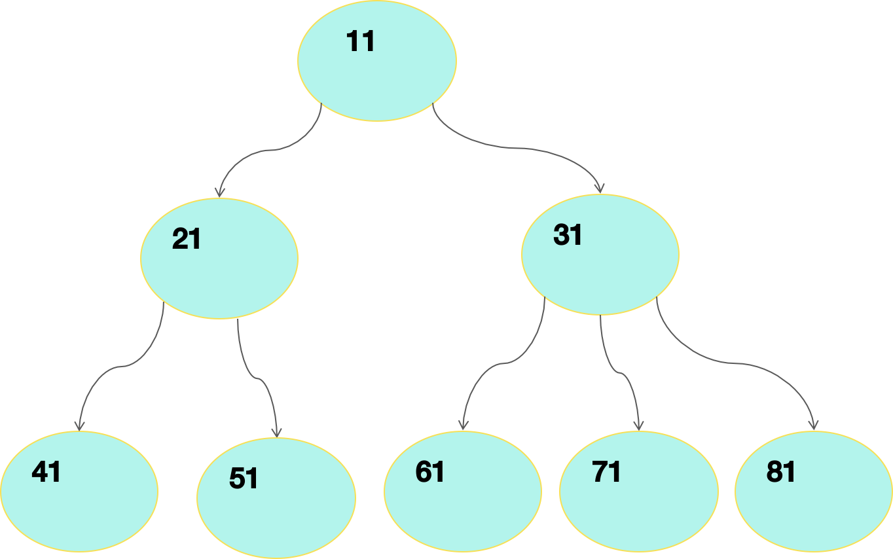
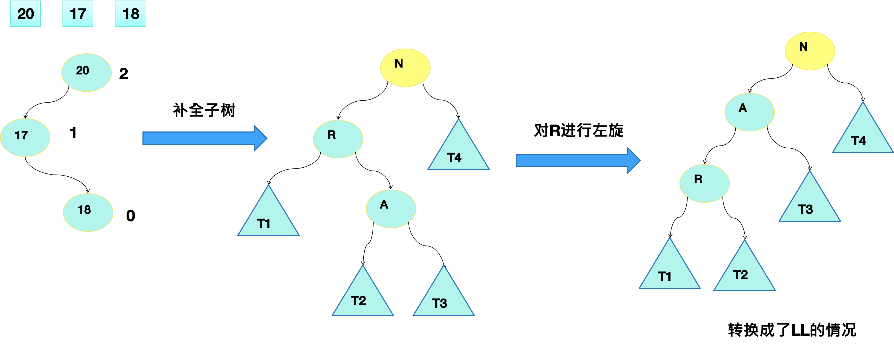

# 树

[TOC]

专业术语：

I.**节点**

II.**根节点**

III.**父节点**

IV.**子节点**

V.**叶子节点** 

VI.**节点的权**

VII.**度**

- 如二叉树，都是2度，两个分支

VIII.**路径**

IX.**层**

X.**子树**

XI.**树的高度**

XII.**森林**

##二叉树的概念

- 每个节点最多只能有两个节点的一种形式的树称为二叉树
- 二叉树的子节点分为左节点和右节点

## 满二叉树

- 所有非叶子节点都存在左子树和右子树，并且所有叶子都在最后一层的二叉树为满二叉树
- 叶子节点只能在最后一层
- 非叶子节点的度一定是2
- 同样深度的二叉树中，满二叉树的节点个数最多，叶子数最多

## 完全二叉树

- 如果该二叉树的所有叶子节点都在最后一层或者倒数第二层，而且最后一层的叶子节点在左边连续倒数第二层的叶子节点在右边连续，我们称为完全二叉树
- 层数为n的完全二叉树，节点总数=2^（n-1）
- 如果节点的度是1，则该节点只有左孩子
- 同样节点数目的二叉树，完全二叉树深度最小
- 满二叉树一定是完全二叉树，反之则不一定

## 二叉搜索树概念

- 二叉搜索树也叫做二叉排序树，任何一个非叶子节点，要求左子节点的值比当前节点的值小，右子节点的值比当前节点的值大
- 如果有相同的值，可以将该节点放在左子节点或右子节点

### 二叉搜索树的深度优先遍历

二叉树的深度遍历分为：前序遍历、中序遍历和后序遍历

**前序遍历** 先输出父节点，然后先左后右遍历

**中序遍历** 先输出左节点，然后先中后右遍历

**后序遍历** 先输出左节点，然后先右后中遍历

### 二叉搜索树的问题

1. 数据（1，2，3，4，5，6）创建一颗BST
2. 左子树全部为空，从形式上看，更像一个单链表
3. 插入速度没有影响
4. 查询速度明显降低
5. 解决方案-使用平衡二叉树

## 平衡二叉树

- 平衡二叉树也叫平衡二叉搜索树，需要满足BST的特征
- 任意一个节点，平衡因子的绝对值不超过1
  - 某节点的高度值max(左子树高度，右子树高度)+1
  - 每个节点的左子树和右子树的高度差叫做平衡因子
- 平衡二叉树的高度和节点数的关系是O(logn)

### 何时需要维护平衡？

- BST中插入新节点时从根节点一路寻找正确的位置该位置一定是叶子位置

- 由于新增加新的节点，才导致了BST不再平衡即平衡因子绝对值>1

- 导致不平衡的节点一定发生在插入路径上的某一处

- 插入是递归插入，因此能够拿到这条完整路径计算这条路径的每个节点的平衡因子

*上图的平衡因子就是左子树和右子树的高度差，就叫做平衡因子（红色框的数字）*

​	

### 右旋产生条件

1. 新插入节点导致了不平衡
2. 不平衡节点在插入的路径上
3. 叶子节点在不平衡节点的左侧的左侧
4. 可以使用右旋来实现

### 右旋后保持平衡

### 左旋

### LR出现不平衡

### RL出现不平衡

